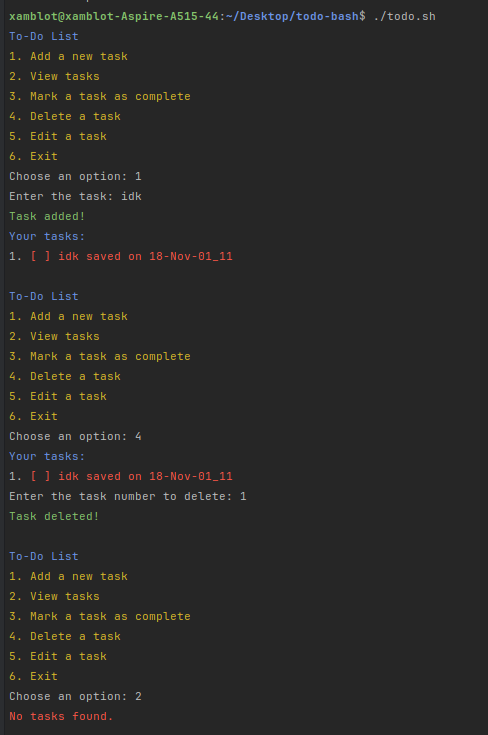

# Todo Bash 

task management tool written in Bash that allows users to **NOT** efficiently manage their to-do lists. 


## Index

- [Todo Bash](#Command-Line-TODO)
  - [Usage](#usage)
  - [Screenshots](#screenshots)
 
## Usage

```Bash
    ./todo.sh
```

## Screenshots

* Add and delete your tasks!
  * 
* Edit Your Tasks
  * 
 